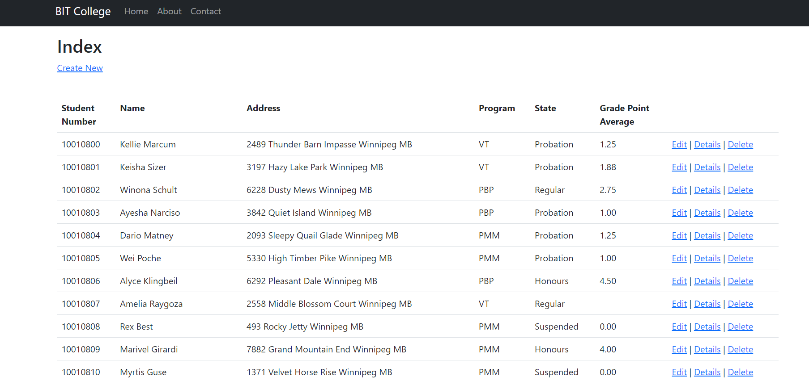
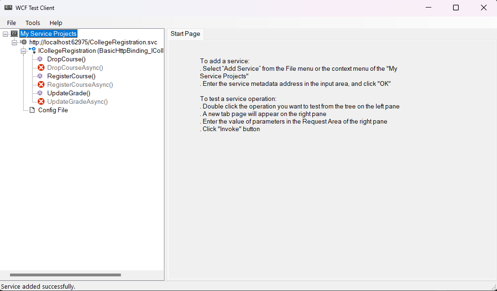
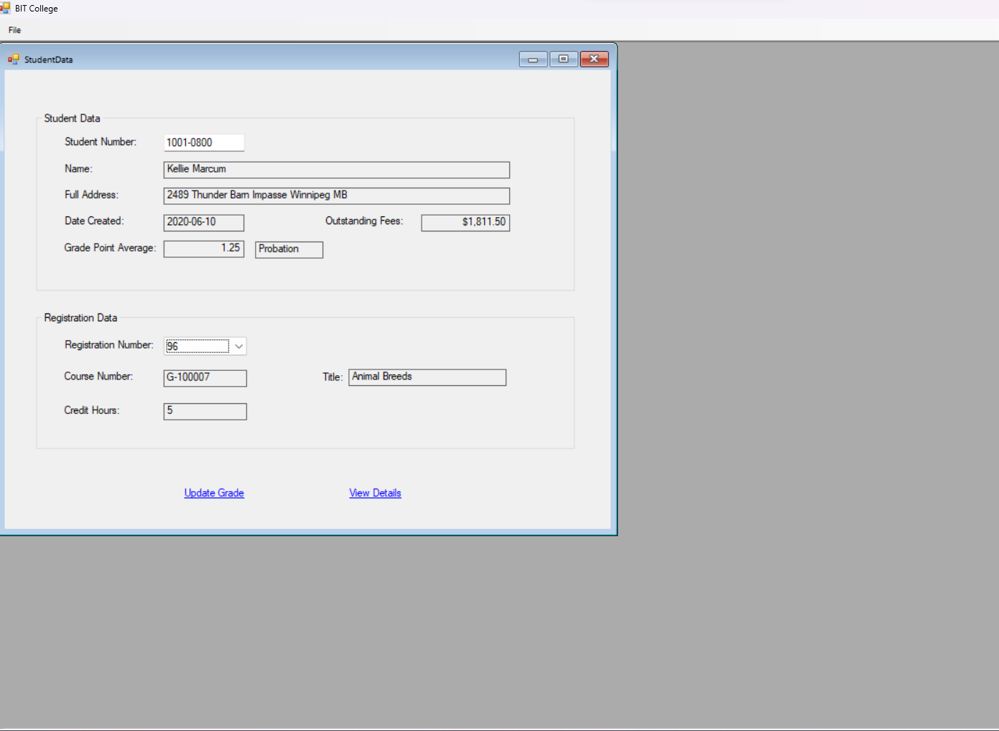
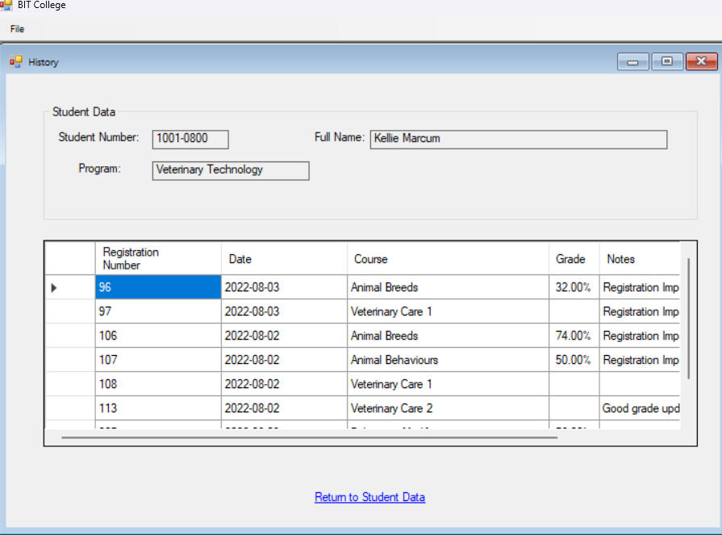

<H1>ASP.NET Programming Project</H1>
<h2>This project utilizes the ASP.NET Web API to develop an MVC mockup college database. </h2>
<h3>This project consists of the following technologies:</h3>
<ul>
  <li>ASP.NET Web API</li>
  <li>Microsoft SQL Server Management Studio</li>
  <li>Windows Communication Foundation Services</li>
  <li>Windows Form Application</li>
</ul>

I developed the following services based on a given class structure. This project highlights the usage of different development patterns and concepts. 
  This includes the implementation of the MVC model, usage of the Singleton Pattern, developing a Web Service, and designing a Windows Form to utilize the web service. Additionally, a component is also developed to read specified XML files to then update information to the database.

ASP.NET Webpage

WCF Testing Client

Windows Form Application

Thank you for reading!

-Jake

